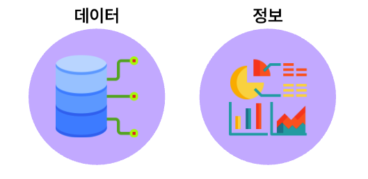
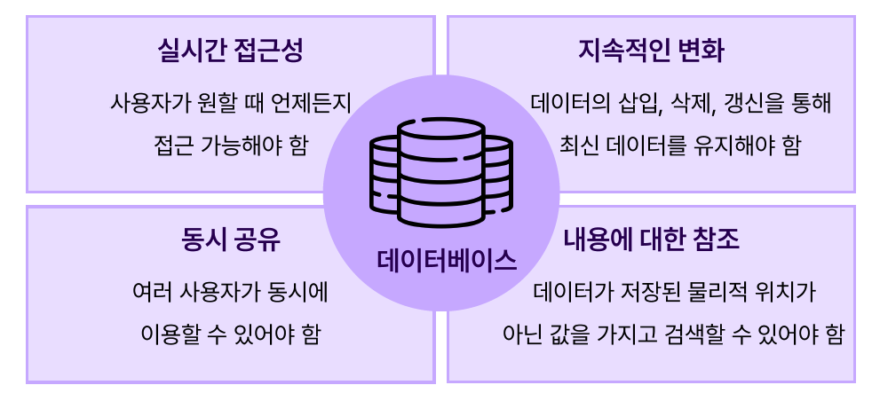
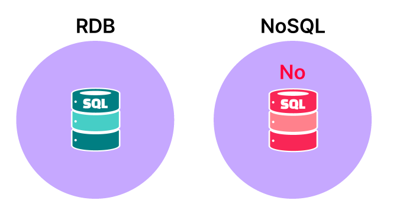
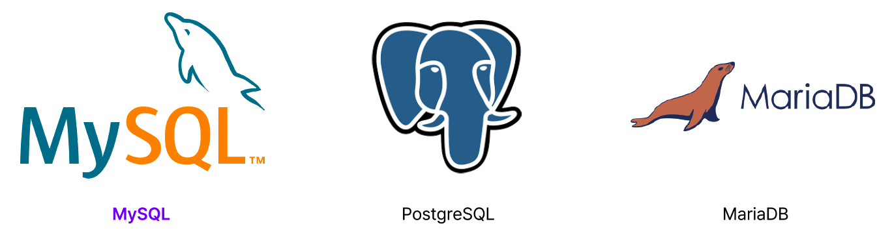

# ✅ 4주차 내용 정리: 데이터베이스 소개

### 👉 목차
1. [데이터와 정보의 이해](#✅-1-데이터와-정보의-이해)
2. [데이터베이스의 개념](#✅-2-데이터베이스의-개념)
3. [데이터베이스의 특징](#✅-3-데이터베이스의-특징)
4. [데이터베이스의 종류](#✅-4-데이터베이스의-종류)
5. [데이터베이스 선택 기준](#✅-5-데이터베이스-선택-기준)
6. [관계형 데이터베이스(RDB)의 구성](#✅-6-관계형-데이터베이스rdb의-구성)
7. [테이블 간 관계(Relation)](#✅-7-테이블-간-관계relation)
8. [테이블 만들기(CREATE TABLE)](#✅-8-테이블-만들기create-table)
9. [테이블 수정하기(ALTER TABLE)](#✅-9-테이블-수정하기alter-table)

# ✅ 1. 데이터와 정보의 이해

## 📌 데이터(Data)란?
>현실 세계에서 단순히 관찰하거나 측정하여 수집한 사실이나 값

데이터는 그 자체로는 의미가 불분명하며, 가공되지 않은 원시 형태의 사실이나 값을 의미한다.

### 👉 데이터의 특성
- **객관성**: 해석이나 판단이 포함되지 않은, 관찰된 사실
- **원시성**: 가공되지 않은 날것 그대로의, 처리 이전 상태
- **다양성**: 텍스트, 숫자, 이미지, 소리, 영상 등 여러 형태로 존재
- **대용량**: 현대 사회에서 방대한 양의 데이터가 생성됨

## 📌 정보(Information)란?
>데이터를 처리하고 조직화하여 의미와 가치를 부여한 결과물

정보는 데이터를 가공, 처리, 조직화하여 의미 있는 형태로 변환한 것으로, 의사결정에 활용될 수 있다.

### 👉 데이터와 정보의 차이

|구분|데이터(Data)|정보(Information)|
|---|---|---|
|정의|가공되지 않은 원시 사실/값|처리된 의미 있는 데이터|
|형태|구조화되지 않음|구조화됨|
|가치|낮음(원재료)|높음(완성품)|
|사용|직접 활용 어려움|의사결정에 직접 활용|
|예시|35.6, 36.5, 39.2|체온 변화 그래프, "발열 상태"|



# ✅ 2. 데이터베이스의 개념

## 📌 데이터베이스란?
>체계적으로 구조화된 데이터의 집합체

데이터베이스(Database, DB)는 다수의 사용자와 애플리케이션이 동시에 접근하여 활용할 수 있도록 통합적으로 관리되는 정보의 저장소.

### 👉 데이터베이스 활용 사례
- 교육기관: 학생 정보 관리 시스템
- 전자상거래: 상품 카탈로그, 주문 내역
- 금융기관: 거래 기록, 계좌 정보
- 의료기관: 환자 진료 기록

### 🔧 데이터베이스 관리 시스템 (DBMS)
데이터베이스 관리 시스템(Database Management System)은 데이터베이스를 생성, 유지, 관리하기 위한 소프트웨어 시스템.

#### 주요 DBMS 제품
|DBMS|제작사|주요 특징|
|---|---|---|
|MySQL|Oracle|오픈소스, 웹 애플리케이션에 많이 사용|
|Oracle|Oracle|기업용 대규모 시스템에 적합|
|PostgreSQL|PostgreSQL|고급 기능, 확장성 우수|

#### DBMS의 주요 기능

- **데이터 정의**: 테이블 구조 생성 및 수정
- **데이터 조작**: 데이터 입력, 조회, 수정, 삭제
- **데이터 검색**: 효율적인 정보 검색 지원
- **접근 제어**: 보안 및 권한 관리

## 📂 파일 시스템과 데이터베이스

### ⚠️ 파일 처리 시스템의 한계

전통적인 파일 처리 시스템은 다음과 같은 단점이 있다:

- **데이터 종속성 문제**: 데이터 구조가 바뀌면 해당 데이터를 사용하는 모든 응용 프로그램도 함께 수정해야 함
- **데이터 중복**: 여러 응용 프로그램이 동일한 데이터를 별도로 저장할 수 있어 저장 공간 낭비 및 일관성 문제 발생
- **무결성 부족**: 데이터에 오류가 있어도 이를 제어하거나 방지하기 어려움
- **동시 접근 제약**: 여러 사용자가 동시에 데이터를 읽거나 쓸 수 없음
- **보안 취약**: 파일 단위로 저장되기 때문에 사용자별로 권한을 세밀하게 제어하기 어려움
- **백업 및 복구의 어려움**: 장애 발생 시 데이터 복구가 어렵고, 백업도 수동으로 처리해야 함

### 🔄 파일 시스템과 데이터베이스 비교

|특성|파일 처리 시스템|데이터베이스 시스템|
|---|---|---|
|데이터 중복|높음|최소화|
|데이터 독립성|낮음|높음|
|데이터 무결성|보장 어려움|제약조건으로 보장|
|동시 접근|제한적|지원|
|보안|제한적|다양한 수준 지원|
|백업 및 복구|어려움|용이|
|데이터 조작|프로그래밍 필요|SQL 등 표준화된 언어 사용|

### 데이터베이스 시스템의 장점

- 데이터 중복 최소화를 통한 저장 공간 최적화
- 데이터 무결성 보장 및 일관성 유지
- 다중 사용자 환경에서의 동시 접근 지원
- 효율적인 검색 및 관리 메커니즘
- 계층적 보안 정책 구현

# ✅ 3. 데이터베이스의 특징

## 🔑 데이터베이스의 주요 특징

### 👉 1. 실시간 접근성(Real-time Accessibility)
- 사용자 요청에 실시간으로 응답
- 예: 온라인 뱅킹에서 계좌 잔액 조회

### 👉 2. 지속적인 변화(Continuous Evolution)
- 데이터의 지속적 갱신으로 최신 상태 유지
- 예: 전자상거래 사이트의 재고 수량 실시간 업데이트

### 👉 3. 동시 공유(Concurrent Sharing)
- 다수 사용자의 동시 접근 및 데이터 공유
- 예: 항공권 예약 시스템의 동시 접근 처리

### 👉 4. 내용 기반 참조(Content-based Reference)
- 물리적 저장 위치가 아닌 데이터 내용으로 검색
- 예: 이름, 주소 등의 값으로 레코드 검색

# ✅ 4. 데이터베이스의 종류

## 🗂️ 데이터베이스 유형 분류

### 👉 1. 관계형 데이터베이스(Relational Database)
>테이블 형태로 구조화된 데이터를 저장하고 관리하는 데이터베이스

#### 주요 특징
- 행(row)과 열(column)로 구성된 2차원 테이블 구조
- SQL을 통한 데이터 조작

#### 대표적 RDBMS

- MySQL
- PostgreSQL
- MariaDB

### 👉 2. NoSQL 데이터베이스(Not Only SQL)
>비관계형 구조로 데이터를 저장하고 처리하는 데이터베이스

#### 주요 특징
- 유연한 스키마 구조(유형의 제한이 없음)
- 데이터 구조가 일관적이지 않고 자주 변경되는 경우에 적합
- 대용량 데이터 처리에 최적화

#### 대표적 NoSQL의 종류

- MongoDB
- Redis
- Cassandra


### 📊 관계형 DB와 NoSQL DB 비교

|특성|관계형 데이터베이스|NoSQL 데이터베이스|
|---|---|---|
|데이터 모델|테이블 기반 구조|다양한 모델(문서, 키-값, 컬럼, 그래프)|
|스키마|고정 스키마(Rigid)|유연한 스키마(Flexible)|
|확장 방식|수직적 확장(Scale-up)|수평적 확장(Scale-out)|
|쿼리 언어|SQL|데이터베이스마다 다양|
|성능|복잡한 쿼리에 적합|대규모 읽기/쓰기에 최적화|


# ✅ 5. 데이터베이스 선택 기준

## 🔍 상황별 최적의 데이터베이스 선택

### 📌 관계형 데이터베이스 적합 사례
- 구조화된 데이터 및 명확한 스키마가 필요한 환경
- 데이터 무결성과 트랜잭션 보장이 중요한 시스템
- 복잡한 조인 및 관계 기반 쿼리가 필요한 경우

#### 적용 분야
- 금융 시스템
- 전사적 자원 관리(ERP)
- 학사 관리 시스템
- 항공권 예약 시스템
- 전통적인 기업 업무 시스템

### 📌 NoSQL 데이터베이스 적합 사례
- 비정형 또는 반정형 데이터를 처리하는 환경
- 대규모 데이터 처리 및 높은 확장성이 필요한 시스템
- 빠른 읽기/쓰기 성능이 중요한 경우

#### 적용 분야
- 소셜 네트워크 서비스
- 실시간 분석 시스템
- IoT 플랫폼
- 콘텐츠 관리 시스템
- 대규모 로그 수집 및 분석

### 💡 선택 기준
1. **데이터 구조**: 구조화된 데이터? 비구조화된 데이터?
2. **확장성 요구사항**: 수직적 확장? 수평적 확장?
3. **트랜잭션 요구사항**: ACID 속성이 필요한가?
4. **쿼리 복잡성**: 복잡한 쿼리가 필요한가?
5. **데이터 볼륨**: 처리해야 할 데이터의 양은?
6. **성능 요구사항**: 읽기 중심? 쓰기 중심?


---

# ✅ 6. 관계형 데이터베이스(RDB)의 구성

관계형 DB는 **표(테이블)** 형태로 데이터를 저장한다.

```
고객 테이블
┌────────────┬───────┬────────────────────┐
│ ID         │ 이름  │ 주소               │
├────────────┼───────┼────────────────────┤
│ kmax6      │ 김민준│ 서울시 관악구 신림동 │
│ flykite    │ 이서연│ 서울시 동작구 대방동 │
└────────────┴───────┴────────────────────┘
```

### 용어 정리
- **속성(Attribute)**: 열(column) → 항목 이름 (ex: 이름, 주소)
- **튜플(Tuple)**: 행(row) → 한 사람의 정보
- **도메인(Domain)**: 속성이 가질 수 있는 값의 범위 (ex: 이름은 문자열)

---

# ✅ 7. 테이블 간 관계(Relation)

> 중복을 줄이고 데이터를 효율적으로 저장하려면 **테이블을 연결**해서 관리해야 한다.

예시: 고객 테이블 + 주문 테이블 연결

```
고객 테이블          주문 테이블
┌───────┐        ┌───────┬──────────────┐
│ ID    │        │ ID    │ 주문번호     │
├───────┤        ├───────┼──────────────┤
│ kmax6 │        │ kmax6 │ 4832-4921... │
│ ...   │        │ ...   │ ...          │
└───────┘        └───────┴──────────────┘
```

→ **ID** 속성을 기준으로 두 테이블을 연결할 수 있다.

---

# ✅ 8. 테이블 만들기(CREATE TABLE)

```sql
CREATE TABLE customer (
  id VARCHAR(10),
  name VARCHAR(10),
  address VARCHAR(30)
);
```

- `VARCHAR(n)` → n글자까지 입력 가능한 문자열

---

## 테이블 목록 & 구조 확인

```sql
SHOW TABLES;        -- DB에 존재하는 테이블 목록 보기  
```

**실행 결과:**
```
+--------------------+
| Tables_in_database |
+--------------------+
| customer           |
+--------------------+
1 row in set (0.00 sec)
```

```sql
DESC customer;      -- customer 테이블의 구조 보기
```

**실행 결과:**
```
+---------+-------------+------+-----+---------+-------+
| Field   | Type        | Null | Key | Default | Extra |
+---------+-------------+------+-----+---------+-------+
| id      | varchar(10) | YES  |     | NULL    |       |
| name    | varchar(10) | YES  |     | NULL    |       |
| address | varchar(30) | YES  |     | NULL    |       |
+---------+-------------+------+-----+---------+-------+
3 rows in set (0.00 sec)
```

---

## 👉SQL 작성 시 규칙

- 키워드(`SELECT`, `FROM`)는 **대문자**
- 테이블/속성명은 **소문자** 권장
- 여러 단어는 **언더바(_)로 연결** → 예: `user_name`
- 명령문 끝엔 꼭 `;` 붙이기
- `--`로 주석 작성 가능

---

## 데이터 삽입 (INSERT)

```sql
-- 순서대로 삽입
INSERT INTO customer (id, name, address)
VALUES ('kmax6', '김민준', '서울시 관악구 신림동');
```

**실행 결과:**
```
Query OK, 1 row affected (0.01 sec)
```

```sql
-- 순서 바꿔도 OK
INSERT INTO customer (name, address, id)
VALUES ('이서연', '서울시 동작구 대방동', 'flykite');
```

**실행 결과:**
```
Query OK, 1 row affected (0.01 sec)
```

```sql
-- 속성명 생략하면 전체 순서대로 입력됨
INSERT INTO customer
VALUES ('freeman123', '박서준', '서울시 관악구 신림동');
```

**실행 결과:**
```
Query OK, 1 row affected (0.01 sec)
```

---

##  데이터 조회 (SELECT)

```sql
-- 원하는 속성만 출력
SELECT id, name FROM customer;
```

**실행 결과:**
```
+------------+--------+
| id         | name   |
+------------+--------+
| kmax6      | 김민준 |
| flykite    | 이서연 |
| freeman123 | 박서준 |
+------------+--------+
3 rows in set (0.00 sec)
```

```sql
-- 순서 바꿔도 OK
SELECT address, name FROM customer;
```

**실행 결과:**
```
+------------------------+--------+
| address                | name   |
+------------------------+--------+
| 서울시 관악구 신림동   | 김민준 |
| 서울시 동작구 대방동   | 이서연 |
| 서울시 관악구 신림동   | 박서준 |
+------------------------+--------+
3 rows in set (0.00 sec)
```

```sql
-- 전체 출력은 *
SELECT * FROM customer;
```

**실행 결과:**
```
+------------+--------+------------------------+
| id         | name   | address                |
+------------+--------+------------------------+
| kmax6      | 김민준 | 서울시 관악구 신림동   |
| flykite    | 이서연 | 서울시 동작구 대방동   |
| freeman123 | 박서준 | 서울시 관악구 신림동   |
+------------+--------+------------------------+
3 rows in set (0.00 sec)
```


---

## ✅ 9. 테이블 수정하기(ALTER TABLE)

테이블을 생성한 후에도 구조를 변경할 수 있다.  
이를 위해 `ALTER TABLE` 명령어를 사용하며, 컬럼의 추가, 수정, 삭제, 이름 변경, 테이블 이름 변경 등이 가능하다.

---

### 📌 1) 컬럼 추가

```sql
ALTER TABLE 테이블명 ADD COLUMN 컬럼명 데이터타입 제약조건;
```

예시:

```sql
ALTER TABLE customer ADD COLUMN birthday DATE NULL;
```

---

### 📌 2) 컬럼 수정

컬럼의 데이터 타입이나 제약조건을 변경할 때 사용한다.

```sql
ALTER TABLE 테이블명 MODIFY COLUMN 컬럼명 데이터타입 제약조건;
```

예시:

```sql
ALTER TABLE customer MODIFY COLUMN id VARCHAR(15) NULL;
```

---

### 📌 3) 컬럼 이름 변경

기존 컬럼명을 새로운 이름으로 바꿀 수 있다.

```sql
ALTER TABLE 테이블명 CHANGE COLUMN 기존컬럼명 새로운컬럼명 데이터타입 제약조건;
```

예시:

```sql
ALTER TABLE customer CHANGE COLUMN name korean_name VARCHAR(10) NOT NULL;
```

---

### 📌 4) 컬럼 삭제

컬럼을 테이블에서 제거할 수 있다.

```sql
ALTER TABLE 테이블명 DROP COLUMN 컬럼명;
```

예시:

```sql
ALTER TABLE customer DROP COLUMN address;
```

---

### 📌 5) 테이블 이름 변경

테이블 자체의 이름을 변경할 때 사용한다.

```sql
ALTER TABLE 기존테이블명 RENAME 새테이블명;
```

예시:

```sql
ALTER TABLE customer RENAME member;
```

---

각 명령어는 테이블 구조를 유연하게 유지·관리할 수 있도록 도와주며,  
초기 설계 이후에도 데이터 스키마를 상황에 맞게 조정할 수 있는 중요한 수단이다.
