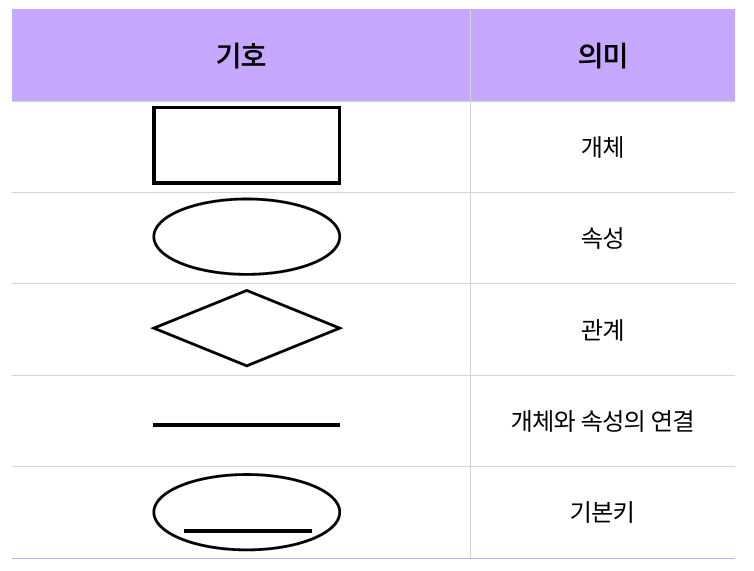

# 데이터베이스 구성하기

### 목차
1. [제약 조건](#✅-1-제약-조건)
2. [키 (Key)](#✅-2-키-key)
3. [데이터 모델링](#✅-3-데이터-모델링)
4. [ER 다이어그램 (Peter Chen)](#✅-4-er-다이어그램peter-chen)

---

# ✅ 1. 제약 조건

### 📌 정의
> 테이블에 잘못된 데이터가 입력되는 것을 방지하기 위한 규칙  
> 제약 조건을 통해 무결성을 지킬 수 있음

```sql
CREATE TABLE customer(
  id VARCHAR(10) NOT NULL,
  name VARCHAR(10) NOT NULL,
  address VARCHAR(30) NULL
);
```

---

### 📌 NOT NULL

```sql
CREATE TABLE customer(
  id VARCHAR(10),
  name VARCHAR(10) NOT NULL
);

INSERT INTO customer (id, name) VALUES ('kmax6', '김민준');
INSERT INTO customer (name) VALUES ('이서연');

-- 에러 발생
-- INSERT INTO customer (id) VALUES ('kmax6');
```

- 널(NULL) 값 비허용
- 데이터를 입력하지 않으면 에러 발생
- 아무것도 명시하지 않는 경우 기본값은 NULL 허용

---

### 📌 UNIQUE

```sql
CREATE TABLE customer(
  id VARCHAR(10) UNIQUE,
  name VARCHAR(10) NOT NULL
);

INSERT INTO customer (id, name) VALUES ('kmax6', '김민준');

-- 에러 발생
-- INSERT INTO customer (id, name) VALUES ('kmax6', '이서연');

INSERT INTO customer (name) VALUES ('김민준');
INSERT INTO customer (name) VALUES ('이서연');
```

- 중복되는 값을 비허용
- 동일한 값이 있으면 에러 발생
- **NULL 값은 비교가 불가능해서 중복되어도 에러 발생하지 않음**

---

### 📌 DEFAULT

```sql
CREATE TABLE customer(
  id VARCHAR(10) UNIQUE,
  name VARCHAR(10) NOT NULL,
  address VARCHAR(30) DEFAULT 'No Address'
);

-- address가 'No Address'로 설정됨
INSERT INTO customer (id, name) VALUES ('kmax6', '김민준');

-- address가 '서울시 관악구 대방동'으로 설정됨
INSERT INTO customer VALUES ('flykite', '이서연', '서울시 동작구 대방동');
```

- 기본값 설정
- 아무런 값을 지정하지 않으면 DEFAULT 값으로 자동 설정됨

---

### 📌 CHECK

```sql
CREATE TABLE customer(
  id VARCHAR(10) UNIQUE,
  name VARCHAR(10) NOT NULL,
  address VARCHAR(30) DEFAULT 'No Address',
  age INT CHECK (age >= 19)
);

INSERT INTO customer VALUES ('kmax6', '김민준', '서울시 관악구 신림동', 20);

-- 에러 발생
-- INSERT INTO customer VALUES ('flykite', '이서연', '서울시 동작구 대방동', 18);
```

- 값의 범위를 제한하여 특정 값만 허용
- 조건을 만족하지 않으면 에러 발생

---

### 📌 제약 조건 정의 (CONSTRAINT)

```sql
CREATE TABLE customer(
  id VARCHAR(10),
  age INT,
  CONSTRAINT id_unique UNIQUE (id),
  CONSTRAINT age_check CHECK (age >= 19)
);
```

- 제약 조건 이름을 직접 정의할 수 있음
- 확인:  
  ```sql
  SELECT * FROM information_schema.table_constraints;
  ```

---

### 📌 제약 조건 추가

```sql
ALTER TABLE customer
ADD CONSTRAINT address_unique UNIQUE (address);

ALTER TABLE customer
ADD CONSTRAINT customer_chk_2 CHECK (age >= 19 AND name = '김민준');

ALTER TABLE customer
ALTER address SET DEFAULT '주소 없음';
```

---

### 📌 제약 조건 삭제

```sql
ALTER TABLE customer DROP CONSTRAINT customer_chk_2;

ALTER TABLE customer
ALTER address DROP DEFAULT;
```
<br>
<br>
<br>
<br>

# ✅ 2. 키 (Key)

## 🔑 키(Key)란?

> 조건에 만족하는 튜플을 찾거나, 정렬할 때 기준이 되는 속성

### 키의 분류

- 🔴 기본키 (Primary Key)
- 🔴 외래키 (Foreign Key)
- ⚫ 후보키 (Candidate Key)
- ⚫ 대체키 (Alternate Key)
- ⚫ 슈퍼키 (Super Key)

---

## 📌 기본키 (Primary Key)

> 서로 다른 튜플을 **유일하게 식별**할 수 있는 기준이 되는 속성

### 특징

- 중복된 값을 가질 수 없음
- 널(NULL) 값을 가질 수 없음
- 테이블 당 **하나만** 설정 가능

```plaintext
┌────────────┬───────┬────────────────────┐
│ ID         │ 이름  │ 주소               │
├────────────┼───────┼────────────────────┤
│ kmax6      │ 김민준│ 서울시 관악구 신림동 │
│ flykite    │ 이서연│ 서울시 동작구 대방동 │
│ freeman123 │ 박서준│ 서울시 관악구 신림동 │
└────────────┴───────┴────────────────────┘
```

---

## 📌 외래키 (Foreign Key)

> 다른 테이블의 기본키를 **참조**하는 속성으로, 테이블 간 관계를 정의할 때 사용

### 특징

- 참조하는 테이블의 기본키 값만 입력 가능
- 참조 대상 테이블에 존재하지 않는 값은 입력 불가

```plaintext
[고객 테이블]                  [주문 테이블]
┌────────────┐              ┌────────────┬──────────────┐
│ ID         │              │ ID         │ 주문번호     │
├────────────┤              ├────────────┼──────────────┤
│ kmax6      │              │ kmax6      │ 4832-4921... │
│ flykite    │              │ flykite    │ 1987-9635... │
│ freeman123 │              │ freeman123 │ 8226-9997... │
└────────────┘              └────────────┴──────────────┘
```

---

## 📌 PRIMARY KEY / FOREIGN KEY 설정 예시

```sql
CREATE TABLE customer(
  id      VARCHAR(10) PRIMARY KEY,
  name    VARCHAR(10),
  address VARCHAR(30)
);

CREATE TABLE order_history(
  customer_id VARCHAR(10),
  order_id    VARCHAR(14),
  FOREIGN KEY (customer_id) REFERENCES customer(id),
  CONSTRAINT order_history_pk PRIMARY KEY (customer_id, order_id)
);
```

- PRIMARY KEY → 기본키 설정
- FOREIGN KEY → 참조 설정

---

## 📌 그 외 키

- **후보키 (Candidate Key)**: 기본키가 될 수 있는 속성. 유일성과 최소성을 만족 (기본키 ⊂ 후보키)
- **대체키 (Alternate Key)**: 후보키 중 기본키가 아닌 속성 (대체키 ⊂ 후보키)
- **슈퍼키 (Super Key)**: 튜플을 유일하게 식별 가능한 속성 집합 (최소성을 만족하지 않아도 됨)

---

## 📌 무결성 제약 조건과 키

- **개체 무결성**: 기본키는 NULL값 또는 중복된 값을 가질 수 없음
- **참조 무결성**: 외래키는 NULL이거나 참조되는 릴레이션의 기본키 값과 동일해야 함

### 추가적인 무결성 제약 조건
- **도메인 무결성**: 속성값은 정의된 도메인에 속해야 함
- **NULL 무결성**: 특정 속성은 NULL 값을 가질 수 없음
- **고유 무결성**: 각 튜플의 속성값은 서로 달라야 함
- **키 무결성**: 테이블에는 최소 1개 이상의 키 존재

<br>
<br>
<br>
<br>

# ✅ 3. 데이터 모델링

> **현실 세계에 존재하는 데이터를 데이터베이스화하는 과정**

---

### 📌 정의

- 현실에 존재하는 개념이나 정보를 **데이터베이스의 구조로 표현**하는 것
- 예: 여러 공유 키보드 서비스를 통합 관리하기 위해 회원, 브랜드, 키보드 데이터를 정리

---

### 📌 데이터 모델과 구성 요소

> 현실 세계의 데이터를 **단순화, 추상화하여 표현**한 모델

| 구성 요소     | 설명 |
|--------------|------|
| **개체(Entity)**     | 데이터를 표현하고자 하는 현실 세계의 개념<br>예: 회원, 키보드 |
| **속성(Attribute)** | 개체에 대한 정보<br>예: 이름, 브랜드명, 가격 |
| **관계(Relationship)** | 개체 간의 연관성<br>예: "고객은 키보드를 대여한다" |

---

### 📌 모델링 과정

1. **개념적 설계**  
   → 현실 세계를 추상적 개념으로 표현  
   → 어떤 정보(개체/관계)를 담을 것인지 결정  
   > 예: 회원, 키보드, 대여 기록 등

2. **논리적 설계**  
   → DBMS에서 사용할 수 있는 구조(스키마) 설계  
   → ERD 작성, 키 정의, 관계 설정

3. **물리적 설계**  
   → DBMS에 실제로 저장할 구조 설계  
   → 인덱스, 테이블 속성, 성능 고려

---

### 📌 예시로 보는 흐름

| 단계 | 설명 |
|------|------|
| 개념적 | "회원", "브랜드", "키보드"라는 개체가 있음 |
| 논리적 | 회원(아이디, 이름), 브랜드(이름, 가격), 관계(대여) |
| 물리적 | CREATE TABLE 문으로 테이블 정의 |

<br>
<br>
<br>
<br>

# ✅ 4. ER 다이어그램(Peter Chen)

> **ERD (Entity-Relationship Diagram)**  
> 현실 세계의 데이터를 개체와 관계 형태로 시각화한 다이어그램  
> - ERD의 대표 표기법 중 하나가 **Peter Chen 표기법**

---

### 📌 정의

- **개체(Entity)**와 **관계(Relationship)**를 통해 데이터 구조를 그림으로 표현  
- 현실 세계를 **개체(사각형)**와 **관계(마름모)**로 나타냄

---

### 📌 Peter Chen 표기 기호
| 기호 | 의미 |
|------|------|
| ▭ (사각형) | 개체 |
| ◯ (타원) | 속성 |
| ◇ (마름모) | 관계 |
| — (직선) | 개체와 속성 연결 |
| ⊂ 속성이 밑줄 | 기본키 (Primary Key) |


---

### 📌 정리

- ERD는 **데이터 구조를 직관적으로 표현**하고,  
- Peter Chen 표기법은 **기본적인 개체-관계 모델링**에 자주 사용됨.


<br>
<br>
<br>
<br>

